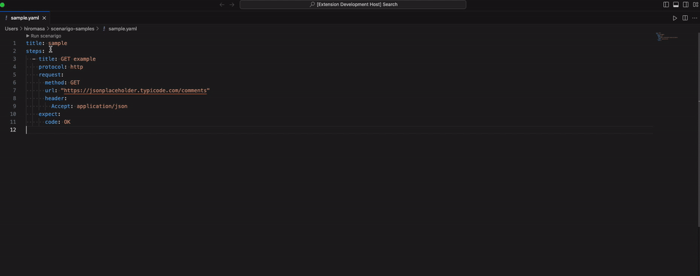

# scenarigo-vscode README

This is the helper tool for [scenarigo](https://github.com/zoncoen/scenarigo) to run scenarigo on VS Code. It allows users to easily run and manage their scenarigo tests directly within the VS Code environment.



## Requirements

This extension requires scenarigo to be installed on your system. 
How to install scenarigo is [here](https://github.com/zoncoen/scenarigo?tab=readme-ov-file#installation)

## Features

- **Run Scenarigo Tests**: With a simple click or command, you can run scenarigo tests on your YAML files. This feature is accessible through the CodeLens interface at the top of your document or via the command palette.

- **Select Configuration Path**: Customize your test runs by selecting different configuration paths. This is especially useful for projects with multiple scenarigo configurations. You can set and change the configuration path from the command palette.

- **Output Panel**: Get real-time feedback on your test runs. The extension provides an output panel where you can see the test results, including any stdout or stderr outputs, as well as the exit code of the scenarigo process.

- **Easy Access to Commands**: The extension contributes commands to the VS Code command palette, making it easy to run tests and select configuration paths without leaving your keyboard.

## How to Use

### 1. Set scenarigo.configPaths and select which configuration path to use

1. Open the command palette and type "Preferences: Open Settings (JSON)".
2. Add the following to your settings.json file:

```json
{
  "scenarigo.configPaths": [
    "path/to/your/scenarigo.yaml"
  ]
}
```

3. Open the command palette and type "Scenarigo: Select Config Path".
4. Choose a configuration path from the list of available options. These options are defined in your workspace settings under `scenarigo.configPaths`.

https://github.com/HiromasaNojima/scenarigo-vscode/assets/67505578/a5f042d7-ab5c-4958-ad72-81bc84ac2d46

### 2. Running Scenarigo Tests

1. Open a YAML file containing your scenarigo test.
2. Click on the "▶️ Run scenarigo" CodeLens at the top of the document, or open the command palette (`Ctrl+Shift+P` or `Cmd+Shift+P`) and type "Scenarigo: Run".
3. The test will run, and you can view the results in the output panel titled "Scenarigo".

https://github.com/HiromasaNojima/scenarigo-vscode/assets/67505578/831e716d-37ff-421b-b1e4-1280ff4995b3

https://github.com/HiromasaNojima/scenarigo-vscode/assets/67505578/b80b4af5-636f-4bbc-bc2e-1d4e3d0f2537


## Known Issues

Currently, there are no known issues. Please report any issues or feature requests on the GitHub repository.

## Release Notes

### 1.0.0

Initial release of scenarigo-vscode

- Run scenarigo tests from VS Code.
- Select different scenarigo configuration paths.
- View test results in a dedicated output panel.
